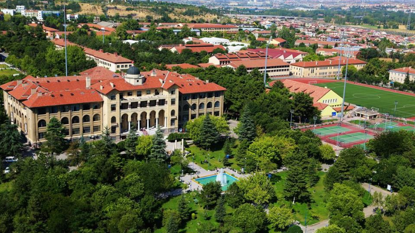
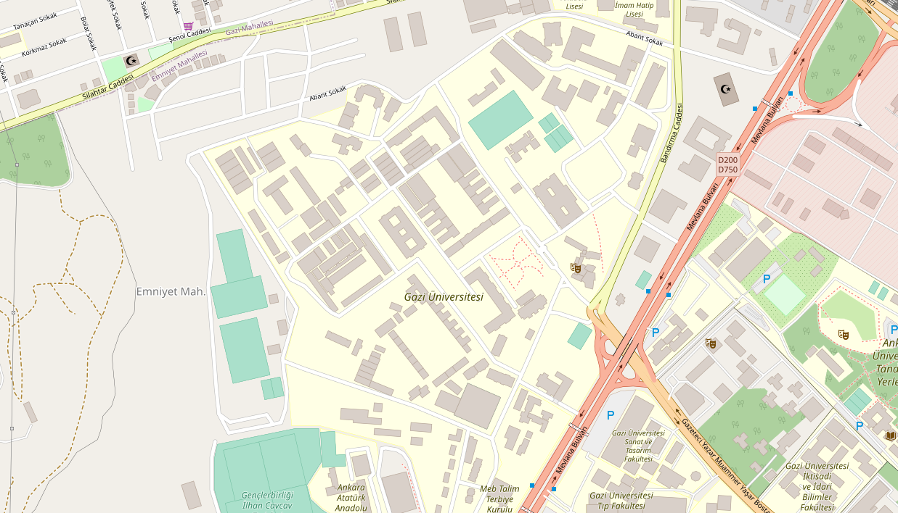

## About

Low-dimensional Materials and Systems (LRG) is a research group studying the physics of semiconductor or dielectric materials with a low-dimensionality involves. For this, the effects of defects, impurities and low-dimensional shapes are investigated. As material groups, we are interested in GaN-based materials, ZnO-based materials, Carbon allotropes and Carbon-based structures (graphene, diamond and SiC) and black phosphorus. 

LRG is located at Laboratory Building, Faculty of Science at Gazi University, Ankara, Turkey.

We are capable to conduct both experimental and calculations studies. More information about our facilities can be found [here](facilities.md).

## Contact Information

Department of Physics, Faculty of Science, Gazi University, Ankara, Turkey 06500
* Laboratory: Lab Building Room 335
* Office: Class Building Room O-3008
* Phone: +90 312 202 1391
* bora-AT-gazi.edu.tr
* [http://www.lrgresearch.org](http://www.lrgresearch.org)

## Map
[Click for detailed map.](https://www.openstreetmap.org/#map=16/39.9378/32.8159)

