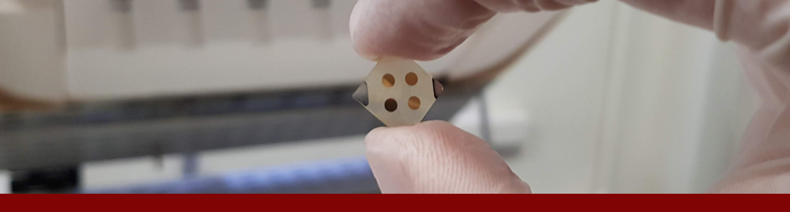

 
> **ANNOUNCEMENT**
> We continuously look for interested students and researchers who want to join the fascinating field of low-dimensional material and device research. If you are looking for a PhD position, a Masters work, please visit [our related page](vacancies.md).

> **DUYURU**
> Düşük boyutlu malzeme ve cihaz araştırmalarının büyüleyici alanına katılmak isteyen ilgilenen öğrencileri ve araştırmacıları sürekli arıyoruz. Bu konularda yüksek lisans ve/veya doktora çalışması gerçekleştirmek istiyorsanız, lütfen [ilgili sayfamızı](vacancies.md) ziyaret ediniz.

## News

#### March 2020

* Congratulations! Polat Narin has been selected as an **Outstanding Reviewer** for **Nanotechnology** for **2019**, in recognition of the high quality and timeliness of his reviews during the year. 

#### February 2020

* Our first study of 2020 **"Effects of Annealing under Different Atmospheres on Structural and Optical Properties of USCVD grown ZnO Nanostructures"** is published at  Mater. Sci. Eng. B. This study is a part of our TUBITAK project 116F197 and second experimental publication from this project.  Study shows the effect of usage of Argon and Oxygen atmospheres in the growth of ZnO nanoparticles in Mist CVD growth method.

#### January 2020

* Prof. Lisesivdin is returned from 3 month-long studies held in Institute for Quantum Optics (IQO), University of Ulm. It was decided to increase the number of studies and collaboration between LRG and IQO.
* New publication **"Investigation of electronic and optical properties of wurtzite MgZnO using GGA + U formalism”** is currently published at Philos. Mag. Lett.  journal. Study is providing a new way to find better electronic structure calculations where classical DFT approaches fell short. 

[more...](newsarchive.md)

## Aestimo 1D

We are supporting  Aestimo 1D Self-consistent Schrödinger-Poisson solver.

[Download v.2.0](https://github.com/aestimosolver/aestimo/releases/download/v2.0/aestimo-v.2.0-master.zip)
