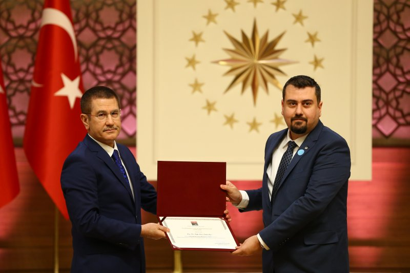

 
Welcome,

Low-dimensional Materials and Devices Research Group (LRG) is a research group within the sub-department of Condensed Matter Physics, which is part of the Department of Physics at Gazi University.

Our research is primarily focused on developing the physics and technology behind high-tech semiconductor devices which are mostly transistors. As material groups, we are interested in GaN-based materials, ZnO-based materials, graphene and black phosphorus. 

We are capable to conduct both experimental and calculations studies. More information about our facilities can be found here.

## Contact Information
Department of Physics, Faculty of Science, Gazi University, Ankara, Turkey 06500
* Laboratory: Lab Building Room 335
* Office: Class Building Room 302
* Phone: +90 312 202 1391
* bora@gazi.edu.tr
* http://www.lrgresearch.org
  
## News

### Rokaia Ibrahem is graduated. Congratulations Ms. Ibrahem, MSc.

*Sep 21 2018, by S. B. Lisesivdin*

Fourth graduation of this year! Rokaia Ibrahem has finished her MSc studies about the studying the electronic and optical properties of wurtzite MgZnO compound with DFT methods with a superior accuracy. Congratulations Rokaia!

### Our start-up company application is supported by TUBITAK! 

*Aug 17 2018, by S. B. Lisesivdin*

Our start-up company plan for building UV-VIS-NIR spectrometer is financially supported by TUBITAK! This year TUBITAK received 3323 entrepreneurial business ideas for the Phase 0. Then after, 1438 entrepreneurs from these applications received Phase I support. Of these entrepreneurs prepared by the related organizations in their technical and business development areas, 422 were accepted for panel evaluations in accordance with the application requirements. TUBİTAK conducted by the academicians, industrialists and investors of the panel evaluation of the results of the 146 entrepreneurs were eligible to pass Phase II (result). Our company is one of them! More news are coming soon. 

### Our project is passed the first phase of TUBITAK 1003 programme

*Aug 09 2018, by S. B. Lisesivdin*

Our project, which is about to produce the "national" random number generator upto 40 Gbit/s, is passed the first phase of the TUBITAK 1003 programme. We have already started to finalize the draft of the submission of second phase. Due date for the submissions for the second phase is at November 2018.

### Oznur Omeroglu is graduated. Congratulations Ms. Omeroglu, MSc.

*Jun 04 2018, by S. B. Lisesivdin*

Two graduations in a single day! Oznur Omeroglu has finished her MSc studies about the investigating the effects of heavy metal doping on the electronic properties of graphene. Congratulations.

### Mehmet Ozturk is graduated. Congratulations Mr. Ozturk, MSc.

*Jun 04 2018, by S. B. Lisesivdin*

Mehmet Ozturk has finished his MSc studies about the investigating the electrical properties of ultrathin barrier GaN HEMTs. Congratulations.

### Dr. Lisesivdin appointed as a full professor

*Mar 21 2018, S. B. Lisesivdin*

Sefer Bora Lisesivdin, has been appointed to full professor to Gazi University, Faculty of Science, Department of Physics.

### Gokhan Atmaca is graduated. Congratulations Dr. Atmaca

*Jan 10 2018, by S. B. Lisesivdin*

Gokhan Atmaca has finished his studies and gained his title. Congratulations.

### Publications in 2017!

*Jan 10 2018, by S. B. Lisesivdin*

We have got 6 new publications in 2016:

* P. Narin, E. Kutlu, G. Atmaca, S. B. Lisesivdin, E. Ozbay "A first principles investigation of the effect of aluminum, gallium and indium impurities on optical properties of B-Si3N4 structure" Optik 147, 115 (2017).
* J. M. Al Abbas, P. Narin, G. Atmaca, E. Kutlu, B. Sarikavak-Lisesivdin, S. B. Lisesivdin "The effect of doping in different layers on 2DEG for ultrathin-barrier AlN/GaN heterostructures" Optoelectron. Adv. Mater.-Rapid Comm. 11, 328 (2017).
* J. M. All Abbas, G. Atmaca, P. Narin, E. Kutlu, B. Sarikavak-Lisesivdin, S. B. Lisesivdin "A Comparative Study of AlGaN and InGaN Back-Barriers in Ultrathin-Barrier AlN/GaN Heterostructures" J. Elec. Mater. 46, 5278 (2017).
* E. Kutlu, P. Narin, G. Atmaca, B. Sarikavak-Lisesivdin, S. B. Lisesivdin, E. Ozbay "Electronic structure of β-Si3N4 crystals with substitutional icosagen group impurities" J. Optoelectron. Adv. Mater. 19, 278 (2017).
Thanks to all colleagues, who made these publications possible.

### Aestimo v.1.2.0 is released!

*Nov 06 2017, by S. B. Lisesivdin*

Nearly one year passed and the new version (v.1.2.0) of Aestimo is ready! Thanks to Robert Steed and Hamza Hebal for their efforts to make Aestimo better. We hope that you enjoy.

Some new features of Aestimo:
* Quaternary alloys (type A_{x}B_{1-x}C_{y}D_{1-y})
* Added an improved model for modeling conduction band intersubband transitions
* Added a periodic boundary condition for the Electric field for modeling repeating structures.
* Small changes were made like to get Aestimo to work on python3.4, example files were renamed to be more pythonic etc …
* Code is moved to GitHub.

Aestimo has a DOI number: 

**R. Steed, H. Hebal, and S. B. Lisesivdin. (2017, November 6). sblisesivdin/aestimo: Version v.1.2 (Version v.1.2.0). Zenodo. http://doi.org/10.5281/zenodo.1042657**

Version 1.2 can be downloaded from this [link](https://github.com/sblisesivdin/aestimo/releases/download/v.1.2.0/aestimo_v.1.2.0.zip). Aestimo is GPL licensed software. Any improvements, bug reports or feedback are welcome.

### 2016 TÜBA "International Academy Prizes, GEBİP and TEÇEP Awards” were handed to the owners and Dr. Lisesivdin received his TUBA / GEBIP Award

*Feb 1 2017, by S. B. Lisesivdin*

2016 TÜBA "International Academy Prizes, GEBİP and TEÇEP Awards” were handed to the owners under the auspices of Presidency with the ceremony held on February 1, 2017 in the Presidential Complex. Assoc. Prof. Sefer Bora Lisesivdin was awarded the TÜBA GEBİP Prize in the category of Physics. He received his award from deputies of Prime Minister Nurettin Canikli.

### Publications in 2016!

*Jan 10 2017, by P. Narin*

We got 6 new publications in 2016:

* P. Narin, E. Kutlu, B. Sarikavak-Lisesivdin, S. B. Lisesivdin, E. Ozbay " Electronic properties of Li-doped zigzag graphene nanoribbons" Physica E 84,  543-547 (2016).
* E. Kutlu, P. Narin , G. Atmaca, B. Sarikavak-Lisesivdin, S. B. Lisesivdin, E. Ozbay " Effect of substitutional As impurity on electrical and optical properties of b-Si3N4 structure" Mater. Res. Bull. 83, 128-134 (2016).
* I. Kara, Y. Sarikavak, S. B. Lisesivdin, M. Kasap "Evaluation of Morphological and Chemical Differences of Gunshot Residues in Different Ammunitions Using SEM/EDS Technique" Environ. Foren. 17, 68 (2016).
* G. Atmaca, P. Narin, B. Sarikavak-Lisesivdin, S. B. Lisesivdin "Two Dimensional Electron Gas in a Hybrid GaN/InGaN/ZnO Heterostructure with Ultrathin InGaN Channel Layer" Physica E 79, 67 (2016).
* G. Atmaca, S. Ardali, E. Tiras, T. Malin, V.G. Mansurov, K.S. Zhuravlev, S.B. Lisesivdin, "Scattering analysis of 2DEG mobility in undoped and doped AlGaN/AlN/GaN heterostructures with an in situ Si3N4 passivation layer", Solid-State Electronics 118, 12-17 (2016).
* G. Atmaca, S. Ardali, P. Narin, E. Kutlu, S. B. Lisesivdin, T. Malin, V. Mansurov, K. Zhuravlev, E. Tiras “Energy relaxation of hot electrons by LO phonon emission in AlGaN/AlN/GaN heterostructure with in situ Si3N4 passivation” J. Alloys Compounds 659, 90 (2016).

Thanks to all colleagues, who made these publications possible.

### Dr. Lisesivdin is selected for Prestigious TUBA / GEBIP Award

*Nov 1 2016, by S. B. Lisesivdin*

Dr. Sefer Bora Lisesivdin, has been awarded with the Turkish Academy of Sciences, Distinguished Young Scientist Award for 2016 in the field of Physics. In the framework of this GEBIP programme of the TUBA, his research activities will be supported for a period of 3 years. The objective of TÜBA-GEBIP is to foster young, outstanding scientists who are at the stage of establishing their own research programmes in Turkey after finishing their post-doctoral research activities. TÜBA supports these scientists for a period of three years and helps them set up their own research groups at a stage when they are in need for incentives.

[more...](newsarchive.md)
