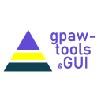

## News

#### August 2022

* A new article **"[Morphological and optical characterizations of different ZnO nanostructures grown by mist-CVD](https://doi.org/10.1016/j.jlumin.2022.119158))"** is published in J. Lumin.

#### July 2022
* [Aestimo 1D version 3.0](https://www.aestimosolver.org/) is released. This is a major release nearly again 2 years after. Because the code base is complicated and the usage of Aestimo is hard to understand, this release is mostly a simplification and clean-up release. Please visit to [release notes](https://www.aestimosolver.org/releasenotes.html#v300-july-13-2022) for more information.
* New version (v22.7.0) of *gpaw-tools* is released. It can be downloaded from *gpaw-tools* [repository](https://github.com/lrgresearch/gpaw-tools). You can find what's new at [release notes](https://www.lrgresearch.org/gpaw-tools/releasenotes/#version-2270) page.

#### May 2022
* New version (v22.5.0) of *gpaw-tools* is released. It can be downloaded from *gpaw-tools* [repository](https://github.com/lrgresearch/gpaw-tools). You can find what's new at [release notes](https://www.lrgresearch.org/gpaw-tools/releasenotes/#version-2250) page.

#### April 2022

* Our new project CuOxMIST: Ga2O3/Cu2O p-n junction production and related computational studies with p-type Cu2O semiconductor thin films grown by Mist-CVD" is accepted by Gazi University. Congratulations.
* New version (v22.4.0) of *gpaw-tools* is released. It can be downloaded from *gpaw-tools* [repository](https://github.com/lrgresearch/gpaw-tools). You can find what's new at [release notes](https://www.lrgresearch.org/gpaw-tools/releasenotes/#version-2240) page.

#### April 2022

* New version (v22.4.0) of *gpaw-tools* is released. It can be downloaded from *gpaw-tools* [repository](https://github.com/lrgresearch/gpaw-tools). You can find what's new at [release notes](https://www.lrgresearch.org/gpaw-tools/releasenotes/#version-2240) page.

#### March 2022

* Beyza Lisesivdin, has been appointed to full professor to Gazi University, Faculty of Science, Department of Physics. Congratulations.
* New version (v22.3.0) of *gpaw-tools* is released. It can be downloaded from *gpaw-tools* [repository](https://github.com/lrgresearch/gpaw-tools). You can find what's new at [release notes](https://www.lrgresearch.org/gpaw-tools/releasenotes/#version-2230) page.

#### February 2022

* Sefa Kazanc is joined to our group. Welcome Sefa.
* Umut Caglar is joined to our group. Welcome Umut.
* A new article **"[A Structural Analysis of Ultrathin Barrier (In)AlN/GaN Heterostructures for GaN‐based High‐frequency Power Electronics](https://doi.org/10.1002/sia.7067)"** is published in Surf. Interface Anal.

#### January 2022

* A new article **"[gpaw-tools–higher-level user interaction scripts for GPAW calculations and interatomic potential based structure optimization](https://doi.org/10.1016/j.commatsci.2022.111201)"** is published in Comput. Mater. Sci.

#### December 2021

* New version (v21.12.0) of *gpaw-tools* is released. It can be downloaded from *gpaw-tools* [repository](https://github.com/lrgresearch/gpaw-tools). You can find what's new at [release notes](https://www.lrgresearch.org/gpaw-tools/releasenotes/#version-21120) page.

#### November 2021

* Assoc. Prof. Dr. Beyza Sarıkavak Lişesivdin was entitled to receive support for 6 months to work at Ulm University, Germany, within the scope of TÜBİTAK 2219 Program. Assoc. Prof. Dr. Sarıkavak Lişesivdin will carry out studies on “NV defect-centered synthetic diamond augmentation and quantum optical characterizations” with Prof. Dr. Fedor Jelezko at the Institute of Quantum Optics.
* Second article in this month, **"[Investigation of Structural and Optical Properties of ZnO Thin Films Grown on Different Substrates by Mist-CVD Enhanced with Ozone Gas Produced by Corona Discharge Plasma](https://doi.org/10.1155/2021/1130829)** which is a result of our D.E.H.A Project, is published in  Advances in Condensed Matter Physics.
* A new article, **[A novel hot carrier-induced blue light-emitting device](https://doi.org/10.1016/j.jallcom.2021.160511)**, which is a  joint study between  Istanbul University, Antalya Bilim University, Bilkent University, Gazi University and Eskisehir Technical University, is published in Journal of Alloys and Compounds.
* New version (v21.11.0) of *gpaw-tools* is released. It can be downloaded from *gpaw-tools* [repository](https://github.com/lrgresearch/gpaw-tools). You can find what's new at [release notes](https://www.lrgresearch.org/gpaw-tools/releasenotes/#version-21110) page.
 
#### October 2021

* New version (v21.10.0) of *gpaw-tools* is released. It can be downloaded from *gpaw-tools* [repository](https://github.com/lrgresearch/gpaw-tools). You can find what's new at [release notes](https://www.lrgresearch.org/gpaw-tools/releasenotes/#version-21100) page.

#### September 2021

* Prof. Lisesivdin and Assoc Prof. Sarikavak-Lisesivdin developed UI/GUI python scripts for GPAW users to facilate GPAW calculations easily. It is called *gpaw-tools*. It is distributed as an open-source software and can be downloaded from **[https://github.com/lrgresearch/gpaw-tools](https://github.com/lrgresearch/gpaw-tools)**. We have a website for *gpaw-tools* at **[here](https://www.lrgresearch.org/gpaw-tools/)**.

#### July 2021

* Mehmet Taha Haliloglu is joined to our group. Welcome Mehmet Taha.

#### June 2021

* Meltem Yayla has finished her studies, passed her viva and gained her title. Congratulations Meltem Yayla, MSc.

* Polat Narin has finished his studies, passed his viva and gained his title. Congratulations Dr. Narin.

#### April 2021

* Third article has been accepted in a month! **"[Effect of magnesium content and growth temperature on structural and optical properties of USCVD-grown MgZnO films](https://link.springer.com/article/10.1007/s00339-021-04507-8)"** which is a result of our D.E.H.A Project, is published in Applied Physics A.

* A new article **"[The effect of barrier layers on 2D electron effective mass in Al0.3Ga0.7N/AlN/GaN heterostructures](https://doi.org/10.1088/1361-648X/abf8d2)"**, which is a  joint study between Gazi University, Eskisehir Technical University, Rzhanov Institute of Semiconductor Physics and Novosibirsk State University, is published in J. Phys.: Condens. Matt.

* A new article **"[Growth dynamics of mist-CVD grown ZnO nanoplatelets](https://doi.org/10.1016/j.physb.2021.413028)"**, which is a result of our D.E.H.A Project, is published in Physica B: Condensed Matter.

#### March 2021

* Meltem Yesiltepe is joined to our group. Welcome Meltem.

#### February 2021

* Rector of Gazi University Prof. Dr. Musa Yıldız came together with the faculty members who contributed the most to our University with the TÜBİTAK and ERASMUS+ projects they carried out in the 2016-2020 period. Prof. Dr. S. B. Lisesivdin [received a certificate of appreciation](http://gazi.edu.tr/gazi-universitesi/view/GetMainNewsPage/266644/rektorumuz-prof-dr-musa-yildiz-yuruttugu-projelerle-universitemize-katki-saglayan-ogretim-uyeleri) because of his contributions to our university with the projects he carried out.

#### January 2021

* Pakize Turhan is joined to our group. Welcome Pakize.
* Gul Ercetin is joined to our group. Welcome Gul.

#### October 2020

* A new article **"[The effect of passivation layer, doping and spacer layer on electron-longitudinal optical phonon momentum relaxation time in Al0.3Ga0.7N/AlN/GaN heterostructures](https://doi.org/10.1016/j.mssp.2020.105449)"**, which is a result of a joint project between Gazi University, Eskisehir Technical University, Rzhanov Institute of Semiconductor Physics and Novosibirsk State University, is published in Mater. Sci. Semicond. Process.

[more...](newsarchive.md)

## We are supporting...

 | [Download v.2.0](https://github.com/aestimosolver/aestimo/releases/download/v2.0/aestimo-v.2.0-master.zip)
 | [Download latest development release](https://github.com/lrgresearch/gpaw-tools/archive/refs/heads/main.zip)

We are actively supporting to develop Aestimo 1D Self-consistent Schrödinger-Poisson solver and gpaw-tools UI/GUI for ASE/GPAW calculator.

