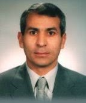
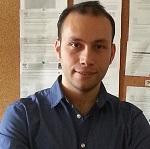

## Faculty Members

 | [Prof. Dr. Mehmet Kasap](https://avesis.gazi.edu.tr/mkasap)
 | [Prof. Dr. Sefer Bora Lisesivdin](https://www.lrgresearch.org/bora/)
 | [Prof. Dr. Beyza Lisesivdin](https://avesis.gazi.edu.tr/beyzas)

## Postdoctorate Research Fellow

 | [Dr Polat Narin](https://sites.google.com/view/polatnarin/home?authuser=0) (@ AYBU)

## Graduate (PhD/Masters) Students

 | Mrs Ece Kutlu Narin, MSc (@ Ankara University, SBL is 2nd supervisor)
 | Ms Meltem Yesiltepe, BEng, MSc
 | Mr Mehmet Taha Haliloglu, MSc
 | Ms Meltem Yayla, BSc
 | Ms Tugce Han, BSc
 | Ms Gul Ercetin, BSc
 | Mrs Pakize Turhan, BSc
 | Mr. Umut Caglar, BEng
 | Mr. Sefa Kazanc, BEng (@ Faculty of Technology, SBL is 2nd supervisor)

## Collaborations (Alphabetically listed)

* Prof. Dr. Naci Balkan (RIP) @ Essex University, UK.
* Prof. Dr. Ayşe Erol @ Istanbul University, Turkey.
* Prof. Dr. Fedor Jelezko @ University of Ulm, Germany.
* Prof. Dr. Ekmel Ozbay @ Bilkent University, Turkey.
* Prof. Dr. Engin Tiras @ Eskisehir Technical University, Turkey.
* Prof. Dr. Abdullah Yildiz @ Ankara Yildirim Beyazit University, Turkey.

## Alumni

### PhD

* Polat Narin @ Ankara Yildirim Beyazit University, Turkey.
* Gokhan Atmaca @ Hongik University, South Korea.

### MSc

* Ece Kutlu Narin @ Ankara Univ, Turkey.
* Kemal Berk Sonmez @ Roketsan, Turkey.
* Mehmet Taha Haliloglu @ AB Mikronano, Turkey.
* Rokaia Ibrahem @ Istanbul University, Turkey.
* Oznur Omeroglu @ Eskisehir Technical University, Turkey.
* Mehmet Ozturk
* Jangeez Mostafa M. Jameel Al Abbas, University of Baghdad, Iraq.
* Elif Yazbahar
* Kenan Elibol @ Max Planck Institute for Solid State Research, Germany.
* Gulser Karakoc
* Cem Gunes
