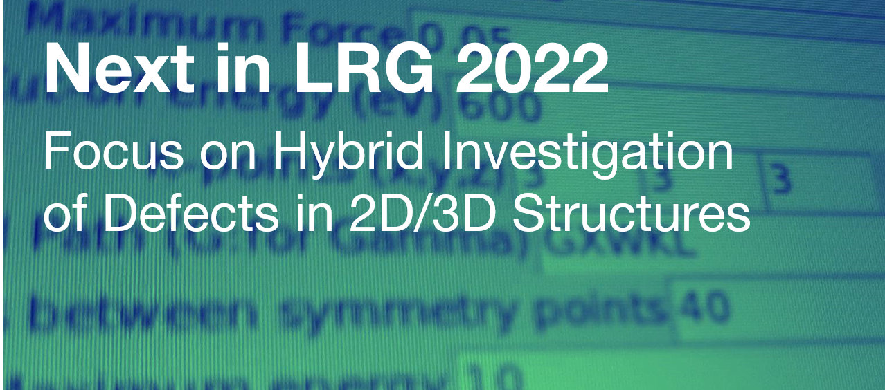
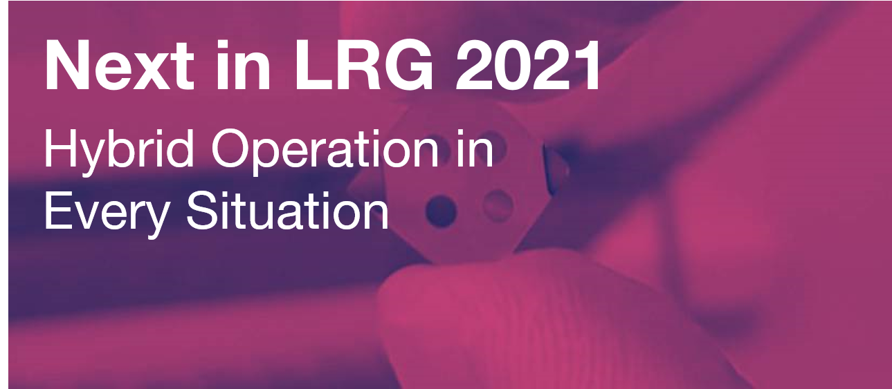

---

[<button class="button button4px">Main Research Subjects</button>](researchsubjects.md)
[<button class="button button4px">Theses and Dissertations</button>](theses-and-dissertations.md) 

---
## Project websites

.

---

## Next in LRG

### Focus on Hybrid Investigation of Defects in 2D/3D Structures (Sep 2021)

As the pandemic continues, we have learned to study, work and educate with computers. LRG has a long past with computational studies and with the changing time, we changed and adapted to the time. As a hybrid group, we can do both experimental and computational studies, every student in our group knows both experimental and computational facilities in the laboratory. We are accepting this as a richness of possibilities. We can purely do computational studies, or experimental. Our projects always have both. Since 2011, we are using ATK for our Density Functional Theory (DFT) studies. However, because of living some problems with getting a new license through Europractice, we have been searching for new possibilities. For this, we chose GPAW for our further studies and have started a small software called gpaw-tools which is a UI/GUI. With gpaw-tools, it is now possible to do nearly all calculations that we have done with ATK. Because we are a small group now, in 2022, we will focus to use GPAW and develop gpaw-tools to make this migration without any problem.

With the migration to GPAW, we also want to focus our studies on the effects of low-dimensional phenomena. With relation to our previous experimental/computational studies done with the University of Ulm, we want to investigate the effects of defects on 2D/3D structures.

We also formed a sister lab at Lab-305 room. It is called Defect Hybrid Analysis Laboratory. It will also work on defects in semiconductors and insulators by computational and experimental ways of work. In Lab 335, we will continue to grow oxide materials and will investigate possible low-dimensional effects.

### Hybrid Operation in every situation (Nov 2020)

With the COVID-19 pandemic, our lives change invariably. As scientists and faculty members of a Gazi University, we have already changed to many things in our education system. With addition of our past experiences involving long term experimental system shutdowns, constructions and similar unpredictable problems we adapted and improved ourselves how to work and what to work.

As LRG Research Group, we want to continue our studies with a hybrid approach in "every sense" in the next few years.

1. **Hybrid working as type**: Beginning with the first days of our group we are studying both experimental and calculational subjects. All our projects included both parts of these study types. We would like to extend our studies in this sense.
2. **Hybrid working as place**: With the pandemic we are now can work locally or remotely. We can provide experimental or calculational subjects to our students with thinking possibility to attend laboratory or not.
3. **Hybrid working as subject**: Most of our subjects involving hybrid material systems to study. For example: We are interested in 2DEG populations in ZnO/GaN based *hybrid* heterostructures. We are also interested in GaN HEMT / Diamond NV center *hybrid* devices for 2DEG mapping. And list can be go up like this. The interactions between two material systems are giving many new possibilities and these possibilities make these subjects attractive.
4. **Hybrid education**: With the pandemic, our university utilized an online education system. We are performing our undergraduate and graduate courses using this system. In addition to these courses, our group uses video lectures in group-wide education of new MSc and PhD students and performing Zoom group meetings as well. Of course we are continuing to study face to face as much as pandemic regulations allows us. 
