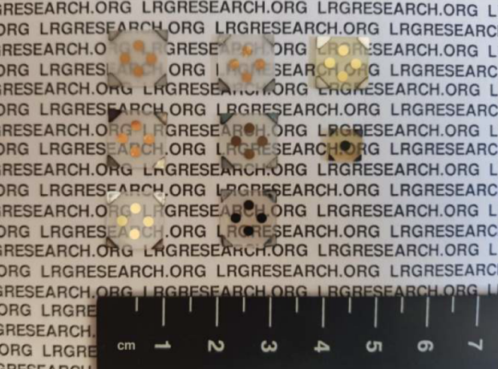
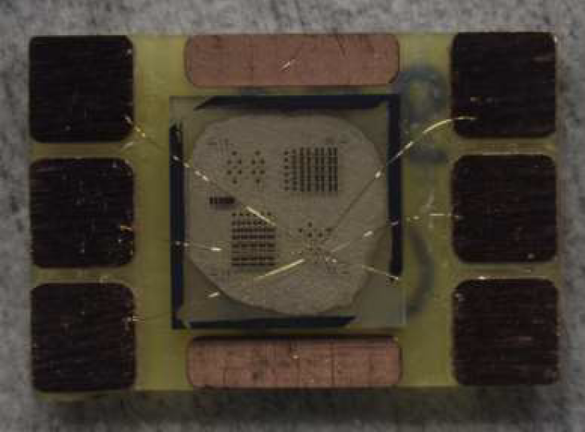

# Main Research Themes
## Low-dimensional Materials and Systems
### Graphene and other 2D structures
* Graphene based transistors
* Investigation of magnetoconductivity and surface properties of exfoliated and epitaxially grown graphene samples
* Investigation of scattering mechanisms in epitaxially graphene on SiC substrate

### Defects and impurity engineering
* Investigation of the effects of defects/impurties to structural, electronic and optical properties in graphene nanoribbons, graphene sheets, other 2D carbon allotropes and 2D black phosphorus, 3D systems as Si3N4, MgZnO.
* Experimental ODMR measurements of NV- centers in Diamond.

## 2DEG in Wide Band-gap Materials
### 2DEG in GaN-based heterostructures (AlGaN/GaN, InAlN/GaN etc.)
* Improvement of two dimensional electron gas (2DEG) well parameters
* Experimental investigation of electron transport, magnetotransport, hot-electron transport properties
* Investigation of effect of Si3N4 surface passivation
* InGaN/GaN multi-quantum wells (MQWs)
* Band engineering; High Electron Mobility Transistor (HEMT) device design and modeling

### 2DEG in ZnO-based heterostructures (MgZnO/ZnO, BeZnO/ZnO etc.)
* Improvement of 2DEG well parameters
* Investigation of hybrid GaN/ZnO heterostructures
* Band engineering; device design and modeling

# Next in LRG
With the COVID-19 pandemic, our lives change invariably. As scientists and faculty members of a Gazi University, we have already changed to many things in our education system. With addition of our past experiences involving long term experimental system shutdowns, constructions and similar unpredictable problems we adapted and improved ourselves how to work and what to work.

As LRG Research Group, we want to continue our studies with a hybrid approach in "every sense" in the next few years.

1. **Hybrid working as type**: Beginning with the first days of our group we are studying both experimental and calculational subjects. All our projects included both parts of these study types. We would like to extend our studies in this sense.
2. **Hybrid working as place**: With the pandemic we are now can work locally or remotely. We can provide experimental or calculational subjects to our students with thinking possibility to attend laboratory or not.
3. **Hybrid working as subject**: Most of our subjects involving hybrid material systems to study. For example: We are interested in 2DEG populations in ZnO/GaN based *hybrid* heterostructures. We are also interested in GaN HEMT / Diamond NV center *hybrid* devices for 2DEG mapping. And list can be go up like this. The interactions between two material systems are giving many new possibilities and these possibilities make these subjects attractive.

# Projects

### Investigation of Growth Behaviors and 2DEG Properties of of MgZnO/ZnO Heterostructures grown by USPECVD Method

*TUBITAK 1001 Project*

With this project, ZnO-based heterostructures were reported for the first time with the USCVD method. In addition, the USCVD method was developed with a remote plasma system and the USPECVD system was installed. Within the scope of the project, MgZnO/ZnO heterostructures were grown with both USCVD and USPECVD methods. For this purpose, ZnO, MgZnO and doped MgZnO growths were performed on soda-lime, SiO2/Si and wurtzite substrates. The grown ZnO and MgZnO structures were examined in detail as a result of both structural and optical characterizations. According to many experimental parameters obtained, ZnO crystals were successfully produced in the form of thin films. MgZnO crystals were found to have a very different growth behavior than ZnO crystals. The 2-dimensional electron gas (2DEG) behavior was observed in low temperatures in the heterostructure. Based on the experience gained with this project, it has been concluded that MgZnO growth has very complex chemistry and this growth behavior should be examined much more deeply within the scope of a new scientific project. With this in-depth analysis of this growth method, more successful and usable MgZnO/ZnO structures can be produced and it can be competed with AlGaN/GaN. 

### High-Performance Modelling and Experimental Investigation of Transport and Device Properties of GaN-based High Electron Mobility Transistors with Ultrathin Barriers

*TUBITAK 3001 Project*

In this project, ultra-thin barrier HEMTs will be designed for different configurations including polarization, voltage and temperature variations, with solving the high-performance self-consistent 1-dimensional Schrödinger-Poisson equations. Band structure, carrier density, and strain distributions are calculated. After design and modelling, the best structures are grown with Metal Organic Chemical Vapor Deposition (MOCVD) method. After, the electrical properties (Hall), and structural properties (Atomic force microscopy, X-Ray Diffraction) of these grown structures are measured. Results are enlighthened us to better understand ultra-thin barrier HEMT structures and result to look forward for producing transistors without the short-channel effects. 

### Modification of properties of two-dimensional electronic gas using in situ surface passivation of AlGaN/GaN heterostructures by molecular beam epitaxy

*Joint grant of Scientific and Technological Research Council of Turkey and RFBR of Russia, TUBITAK 2532 Project*

In this project, the effect of in situ grown Si3N4 passivation on electrical, optical and structural properties of 2DEG including AlGaN/GaN structures were investigated in details. For the characterization, Hall effect, quantum Hall effect, high-speed pulse high electric field measurements, Raman, atomic force microscopy, x-ray diffraction and photoluminescence measurements were taken and analyzed. In addition to these experimental methods, the effect of several impurities on electronic and optical properties of Si3N4  material was investigated with density functional theory. In addition, some transistor parameters of high power transistors with Si3N4 passivation with impurities were calculated with device simulations. 

# Theses and Dissertations

* RF magnetron sputter system and passive circuit element resistor production and characterization
* Back side via hole etching application of SiC for GaN based field effect transistors
* Investigations of low-field transport and hot-electron transport in passivated AlGaN/GaN hemts with Si3N4
* Electrical characteristics of GaAs/AlGaAs structures in the wide frequency ranges
* Investigation of electronic and optical properties of wurtzite MgZnO with first principles calculations
* Investigation of the electronic properties of Zn, Cd and Hg doped graphene sheets with ab-initio methods
* Electrical characteristics and scattering analysis of ultrathin barrier GaN-based high electron mobility transistors
* The investigation of the effect of Al, Ga, In and As impurities on electronic and optical properties of beta-Si3N4 compound with density functional theory
* Simulation and optimation of GaN-based ultrathin barrier high electron mobility transistors
* Electron And Magnetotransport Investigatıon Of 2- Dimensional Electron Gas In Ultrathin Barrier GaN-Based Heterostructures
* Numerical investigation of the 2-dimensional carriers in AlQN/AlN/GaN--based (Q=Ga, In) transistors with multi-quantum well back-barriers
* Investigation of electronic properties of Pd-terminated graphene nanoribbons
* Investigation of magnetoconductivity and surface properties of exfoliated and epitaxially grown graphene samples
* Investigation of electron transport properties AllnN/AlN/(InGaN)/GaN in multi-structures with InGaN quantum well

For more information about researcher and supervisor of each thesis or dissertation, please visit our [Theses and Dissertation Page](theses-and-dissertations.md).
